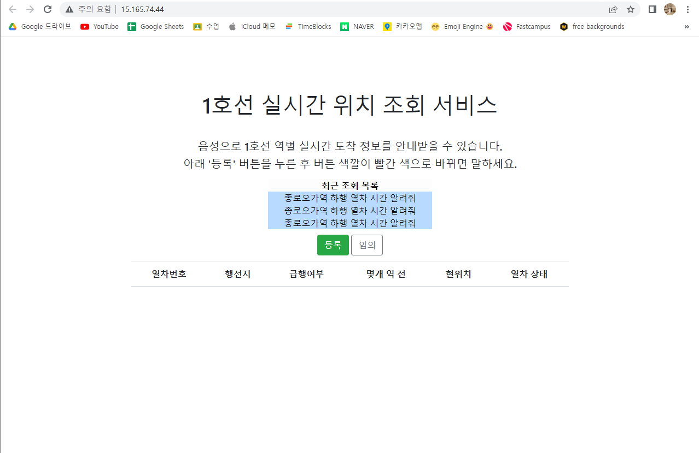

# poo

1. "등록" 버튼은 음성을 넣어 조회할 수 있음
2. 임의 버튼은 문장을 임의대로 넣어 조회할 수 있음

# Flask + EC2
1. 인스턴스 생성
2. Key Pair 권한 설정 변경(microsoft account)
3. 보안 그룹 설정(5000, 80 port)
4. cmd 열기
5. User/rltmdals/.ssh/{Key pair 위치} 
6. 키 위치에서 "ssh -i ".pem" ubuntu@"
7. sudo apt update
8. sudo apt install python3
9. sudo apt install python3-pip
10. sudo apt install python3-venv
11. mkdir venvs
12. (ubuntu@jumpto:~/venvs$) python3 -m venv myproject
13. (ubuntu@jumpto:~/venvs/myproject/bin$) . activate
14. pip install wheel
15. pip install flask
16. pip install flask-migrate
17. pip install Flask-SQLAlchemy==2.5.1
18. pip list
```Python
Package            Version
------------------ ---------
alembic            1.10.1
certifi            2022.12.7
charset-normalizer 3.1.0
click              8.1.3
Flask              2.2.3
Flask-Migrate      4.0.4
Flask-SQLAlchemy   3.0.3
greenlet           2.0.2
idna               3.4
itsdangerous       2.1.2
Jinja2             3.1.2
Mako               1.2.4
MarkupSafe         2.1.2
pip                23.0.1
PyAudio            0.2.13
requests           2.28.2
setuptools         67.4.0
SQLAlchemy         2.0.3
typing_extensions  4.5.0
urllib3            1.26.14
Werkzeug           2.2.3
wheel              0.38.4
```
(버전을 잘 확인해볼것)


19. git clone "git-url" myproject
20. 환경변수 설정
```Python
export FLASK_APP=pybo
export FLASK_DEBUG=true
export FLASK_RUN_PORT=80
```
21. pybo 파일 윗단으로 이동하여
```Python
flask db init (데이터 베이스 초기화하는 명령어)
flask db migrate
flask db upgrade
```
23. sudo 권한없이 80번 포트로 바꾸는 법
```Python
sudo apt install authbind
sudo touch /etc/authbind/byport/80
sudo chmod 777 /etc/authbind/byport/80
authbind --deep flask run --host=0.0.0.0
```
22. pyaudio 설치 오류났을 때
```Python
pip list
pip install pyaudio - (error: subprocess-exited-with-error)라는 오류 발생
sudo apt-get install portaudio19-dev
pip install pyaudio (설치 성공)
pip list로 확인
```
